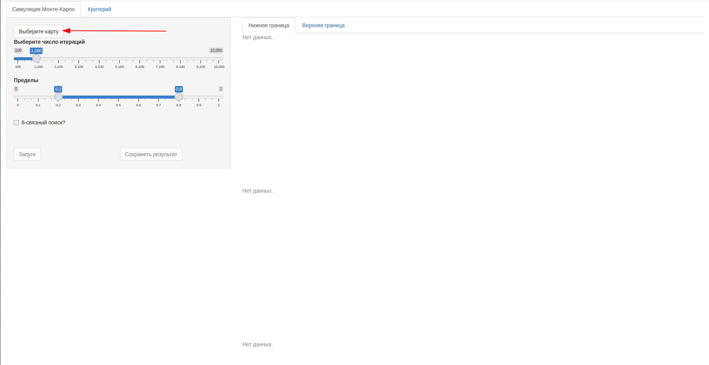
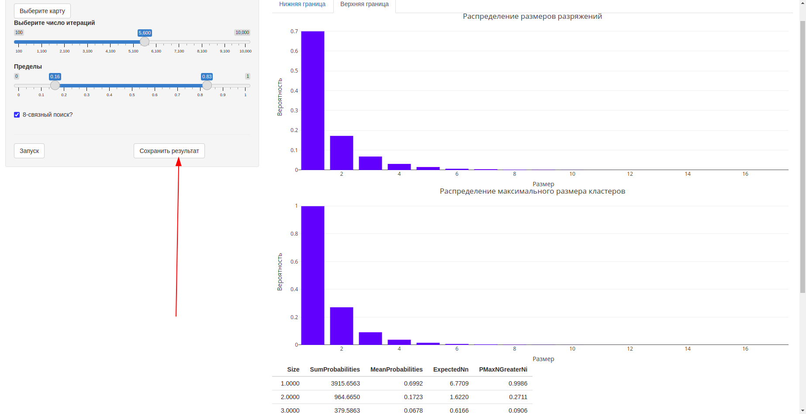
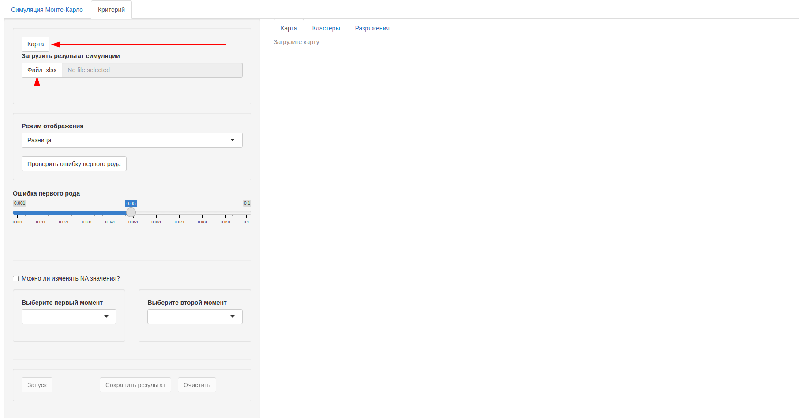
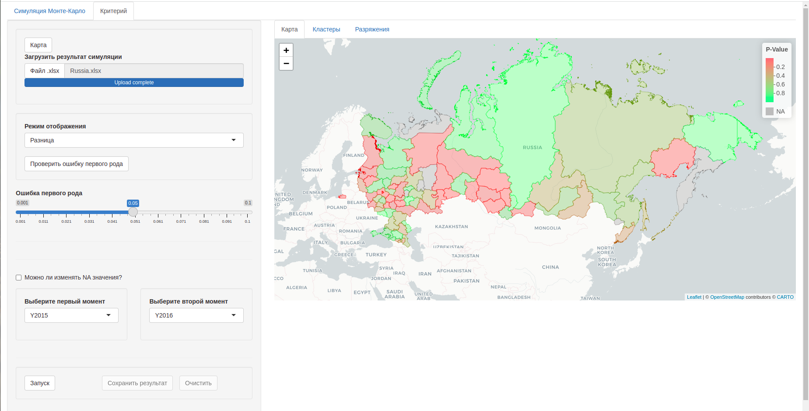
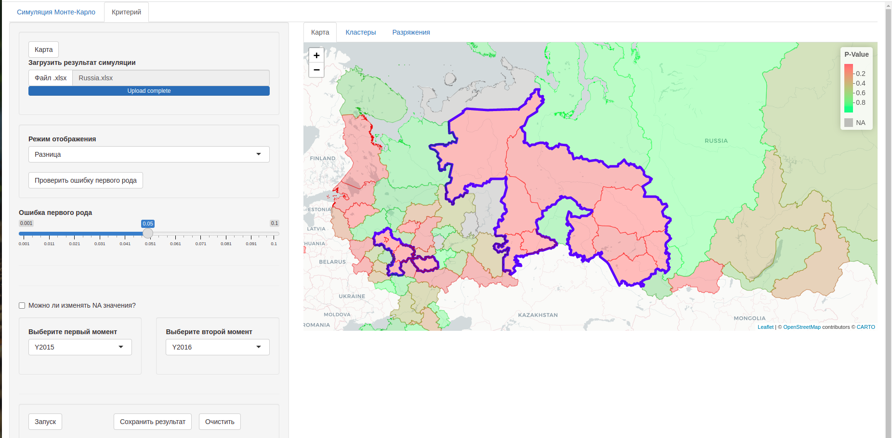
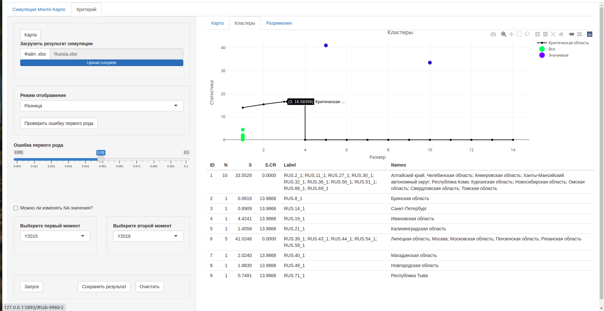
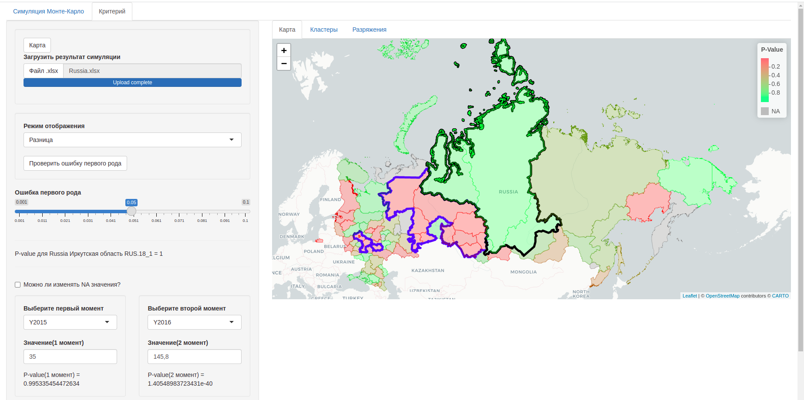
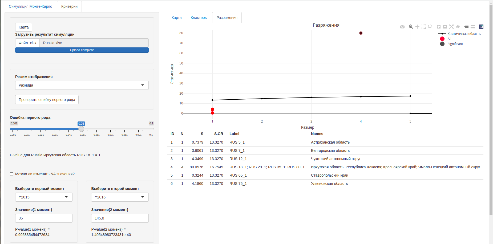

```{r setup, include=FALSE}
knitr::opts_chunk$set(echo = TRUE)
```

# Критерий Пятницкого-Гукасова-Смирнова

<p>

Добро пожаловать в программу, реализующий критерий Пятницкого-Гукасова-Смирнова для поиска кластеров/разряжений в популяционных пространственных данных. Чтобы процитировать нас, укажите следующие статьи:

1.  Пятницкий, А. М. Кластеризация данных методом "расширения точек" / А. М. Пятницкий, В. М. Гукасов, А. С. Смирнов // Медицина и высокие технологии. -- 2020. -- № 2. -- С. 9-14. -- EDN NSGUTS.
2.  Пятницкий, А. М. Поиск кластеров событий в эпидемиологии и экологическом мониторинге / А. М. Пятницкий, В. М. Гукасов, А. С. Смирнов // Медицина и высокие технологии. -- 2020. -- № 4. -- С. 29-37. -- EDN ULSCTY.
3.  Пятницкий, А. М. Поиск кластеров событий для данных, представленных в виде частотных таблиц, и его применение в эпидемиологии и экологическом мониторинге / А. М. Пятницкий, В. М. Гукасов, А. С. Смирнов // Медицина и высокие технологии. -- 2021. -- № 2. -- С. 7-17. -- DOI 10.34219/2306-3645-2021-11-2-7-17. -- EDN YYPGDT.
4.  Пятницкий, А. М. Поиск кластеров в популяционных данных / А. М. Пятницкий, В. М. Гукасов, А. С. Смирнов // Медицина и высокие технологии. -- 2021. -- № 3. -- С. 63-71. -- DOI 10.34219/2306-3645-2021-11-3-63-71. -- EDN ZURQAI.

</p>

# Принцип работы критерия


1.  Даны частоты для каждой области, назовем их $O$
2.  Допустим, размеры популяций в каждой области одинаковыми и средняя частота по всем ячейкам не мала $\overline{O}>5$
3.  Тогда

-   Для пространственная неоднородности\begin{equation}\label{eq:}
          p_i = \Phi (\frac{O_i - \overline{O}}{\sqrt{ \overline{O}}})
          \end{equation}

-   Для сравнения моментов времени\begin{equation}p\_i = \\Phi (\\frac{O\^{t_1}\_i - O\^{t_2}\_i}{\\sqrt{O\^{t_1}\_i + O\^{t_2}\_i}})\\end{equation}

4.  Соприкасающиеся ячейки(группы), попадающие в диапазон $[0;p_{down}]$ - кластеры
5.  Соприкасающиеся ячейки(группы), попадающие в диапазон $[p_{up};1]$ - разряжения
6.  Статистика для разряжений \begin{equation*}
        S_n = -2\sum_{k=1}^{n}\frac{p_k}{p_{down}}
        \end{equation*}
7.  Статистика для кластеров \begin{equation*}
        S_n = -2\sum_{k=1}^{n}\frac{1 - p_k}{1 - p_{up}}
        \end{equation*}
8.  При справедливости $H_0$ справедливо \begin{equation*}S\_n \\sim \\chi\^{2}\_{2n}\\end{equation\*}


# Подготовка данных


<p>

Для работы с веб-сервисом, необходимо подготовить данные. В качестве примера будем использовать данные по заболеваемости ВИЧ по РФ в 2015-2016 годах. Данные взяты с сайта <https://russia.duck.consulting/maps/220/2015> . Они, в свою очередь, указывают источник данных - ЕМИСС.

</p>

## Импорт библиотек


```{r echo = F}
library(raster)
```


## Скачивание карты


<p>

Сервис работает с форматом <b>ESRI Shapefile</b>. Административную карту любой страны можно получить с помощью библиотеки <i>raster</i>.

</p>

<p>

Т.к. библиотека не учитывает изменения в административном составе России и Украины, нам придется это сделать самостоятельно.

</p>

```{r}
#Первый аргумент - название источника
#Второй аргумент - 3-буквенный код страны
#level - 0 - просто границы стран, 1 - страны с первичным административным делением(области, штаты и т.п.)
#path - куда скачать файлы
rus.without.crimea = getData('GADM', country='RUS', level=1,path = "/home/stotoshka/Documents/test")
ukr = getData('GADM', country='UKR', level=1,path = "/home/stotoshka/Documents/test")
```

<p>

"Выделяем" Крым из Украины, и вносим некоторые изменения для красоты.

</p>

```{r}
crim.reg.name = c("Crimea","Sevastopol'")
crimea = ukr[which(ukr@data$NAME_1 %in% crim.reg.name),]
crimea@data$GID_0 = c("RUS","RUS")
crimea@data$NAME_0 = c("Russia","Russia")
crimea@data$GID_1 = c("RUS.84_1","RUS.85_1")
crimea@data$GID_1 = c("RUS.84_1","RUS.85_1")
crimea@data$NAME_1 = c("Crimea","Sevastopol'")
crimea@data$VARNAME_1 = c("Crimea","Sevastopol'")
crimea@data$NL_NAME_1 = c("Республика Крым","Севастополь")
crimea@data$TYPE_1 = c("Respublika","Gorsovet")
crimea@data$ENGTYPE_1 = c("Republic","City")
crimea@data$HASC_1 = c(NA,NA)
#Почему-то имя Москвы изначально NA
rus.without.crimea@data[43,"NL_NAME_1"] = "Москва"
```

<p>

Присоединяем Крым к России

</p>

```{r echo=FALSE}
russia = rbind(rus.without.crimea, crimea)
```

<p>

Загружаем данные о заболеваемости. В них вручную были исправлены названия регионов. В дальнейшем такие же обозначения присвоим такиеже значения регионам в карте.

</p>

```{r}
aids.data = read.csv("/home/stotoshka/Documents/test/Заболеваемость_ВИЧ.csv",header = F)
colnames(aids.data) = c("Year", "Region", "Prevalence")
```

```{r}
russia@data$NAME_1 = c("Республика Адыгея"                 ,"Алтайский край"                    ,"Амурская область",                 
                       "Архангельская область"             ,"Астраханская область"              ,"Республика Башкортостан",          
                       "Белгородская область"              ,"Брянская область"                  ,"Республика Бурятия",               
                       "Республика Чечня"                  ,"Челябинская область"               ,"Чукотский автономный округ",                    
                       "Чувашская Республика"              ,"Санкт-Петербург"                   ,"Республика Дагестан",              
                       "Республика Алтай"                  ,"Республика Ингушетия"              ,"Иркутская область",                
                       "Ивановская область"                ,"Республика Кабардино-Балкария"     ,"Калининградская область",          
                       "Республика Калмыкия"               ,"Калужская область"                 ,"Камчатская край",                  
                       "Республика Карачаево-Черкессия"    ,"Республика Карелия"                ,"Кемеровская область",              
                       "Хабаровский край"                  ,"Республика Хакасия"                ,"Ханты-Мансийский автономный округ",             
                       "Кировская область"                 ,"Республика Коми"                   ,"Костромская область",              
                       "Краснодарский край"                ,"Красноярский край"                 ,"Курганская область",               
                       "Курская область"                   ,"Ленинградская область"             ,"Липецкая область",                 
                       "Магаданская область"               ,"Республика Марий Эл"               ,"Республика Мордовия",              
                       "Москва"                            ,"Московская область"                ,"Мурманская область",               
                       "Ненецкий автономный округ"         ,"Нижегородская область"             ,"Республика Северная Осетия-Алания",
                       "Новгородская область"              ,"Новосибирская область"             ,"Омская область",                   
                       "Орловская область"                 ,"Оренбургская область"              ,"Пензенская область",               
                       "Пермская край"                     ,"Приморский край"                   ,"Псковская область",                
                       "Ростовская область"                ,"Рязанская область"                 ,"Республика Саха",                  
                       "Сахалинская область"               ,"Самарская область"                 ,"Саратовская область",              
                       "Смоленская область"                ,"Ставропольский край"               ,"Свердловская область" ,            
                       "Тамбовская область"                ,"Республика Татарстан"              ,"Томская область",                  
                       "Тульская область"                  ,"Республика Тыва"                   ,"Тверская область",                 
                       "Тюменская область"                 ,"Удмуртская Республика"             ,"Ульяновская область",              
                       "Владимирская область"              ,"Волгоградская область"             ,"Вологодская область",              
                       "Воронежская область"               ,"Ямало-Ненецкий автономный округ"   ,"Ярославская область",              
                       "Eврейская автономная область"      ,"Забайкальский край"                ,"Республика Крым",                  
                       "Севастополь" )
```

<p>

Вставляем данные в карту

</p>

```{r}
for (y in 2015:2016) {
    a = aids.data[aids.data["Year"] == y,]
    col_name = paste0("Y",y)
    for (reg in a$Region) {
        russia@data[which(russia@data$NAME_1 == reg),col_name] = a[which(a$Region == reg),"Prevalence"]
    }
}
```

<p>

Всё готово, можно сохранять карту и её использовать в веб-сервисе

</p>

```{r}
rgdal::writeOGR(russia,"/home/stotoshka/Documents/test/Russia",
                layer = "Russia",
                driver = "ESRI Shapefile",
                overwrite_layer = T,
                layer_options = 'ENCODING="UTF-8"')
```


# Построение критической области


<p>

Перед тем как начинать работу с критерием, необходимо построить критическую область. Для этого указываем папку с картой, выставляем нужные параметры и запускаем симуляцию.

</p>



<p>

8-связный поиск - параметр поиска соседей по матрице смежности. Уместна шахматная аналогия. Ходить ли по матрице смежности как королева или как ладья?

</p>

<p>

Не забываем сохранить результат

</p>




# Запуск критерия


<p>

Теперь у нас есть всё необходимое для запуска критерия. Придется заново загрузить карту и результаты симуляции(постараемся исправить этот недостаток в следующих обновлениях). Выыбрать допустимый уровень ошибки первого рода и столбцы с данными.

</p>

Режимы работы критерия:


1. Первый момент - используя формулу (1), ищет кластеры/разрежения по <b><i> первому </b></i>столбцу
2. Второй момент - используя формулу (1), ищет кластеры/разрежения по <b><i> второму </b></i>столбцу
3. Разница - использует формулу (2) и оба столбца

<b>Убедитесь, что выбранные столбцы имеют числовой тип (numeric,double,integer и т.п.)!</b>  


# Результат




<p>

Найдено два кластера. Синие точки на графике S от n.

</p>



<p>

Результаты можно проинтерпретировать как значимое снижение заболеваемости ВИЧ в этих регионах. Но для точного заключения необходимо смотреть, какие меры принимались для снижения заболеваемости в них.

</p>

<p>

Программа позволяет изменять данные в для регионов, тем самым открывая простор для экспериментов. Изменим значение за 2015 год для Иркутской области в меньшую сторону

</p>



<p>

Найдено одно разряжение вдобавок к двум кластерам. Черная точка на графике.

</p>


